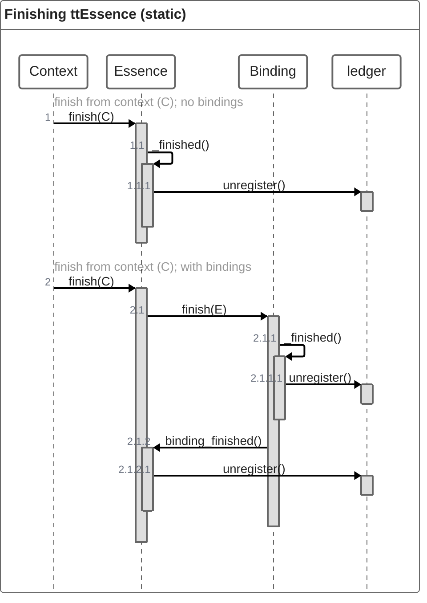

When essence.finish is called the essence will check if it has 1 or more bindings. If not the essencese is finished and unregistered in the ledger.
If the essence does have a binding, the finish of that binding is called. After calling unregister the method binding_finished of its context is called (the context is the initiating essence). In that method the essence unbinds and checks if there are bindings left. If not it will unregister it self.

There is one extra functionality, not in the timeline. If the essence is a service and the calling context is in its service context list, that context is removed and binding finished is called. However, when the creating context is finishing the service, all service bindings get notified with binding_finished, and the service finishes as normal.

## Tonic finish

2 system sparkles are created. _ttss_finish wil be called from the (rewriten) finish method. In the sparkle, super().finish is called. The same for _ttss_binding finished called from binding_finished.

Besides that, in _ttss__finish the sparkle execution wil be set to the system sparkles only mode. The tonic is finishing and dont execpt normal commands or events.

