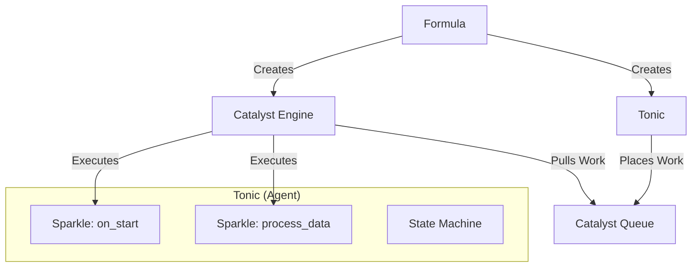
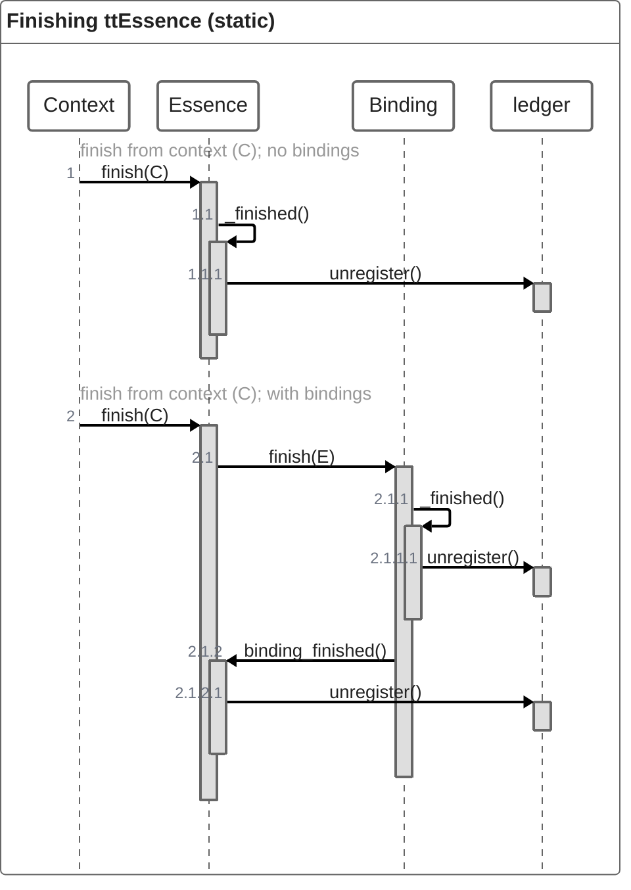

# TaskTonic Framework: Developer Manual

## 1. Introduction

**TaskTonic** is a Python framework designed to manage complex, asynchronous applications with ease. It allows you to
build responsive UIs, sensor networks, and simulation engines without the headache of traditional multi-threading.

### The Philosophy

The framework uses an "Alchemist" metaphor. Instead of calling methods directly, you create "Tonics" (agents) that
emit "Sparkles" (atomic actions), all driven by a "Catalyst" (engine).

**Key Benefits:**

* **Event-Driven:** "Don't call us, we'll call you."
* **Thread Safety:** Tasks are processed sequentially by the Catalyst, removing race conditions.
* **State Machines:** Tonics have built-in state management.
* **Hierarchy:** Automatic lifecycle management for parent/child tasks.

---

## 2. Core Concepts (The Lexicon)

Understanding the vocabulary is crucial to using TaskTonic effectively.

| Term | Component | Description |
| :--- | :--- | :--- |
| **Formula** | `ttFormula` | The "recipe" for your app. The entry point where you define initial tasks. |
| **Tonic** | `ttTonic` | The worker agent. A stateful object that executes tasks. |
| **Sparkle** | Method | A specific unit of work (a method) inside a Tonic. |
| **Catalyst** | `ttCatalyst` | The engine. It pulls "Sparkles" from a queue and executes them. |
| **Ledger** | `ttLedger` | The registry that tracks all active Tonics. |

### Architecture Overview



**

---

## 3. Getting Started

### A Simple "Hello World"

To create an application, you need a `Tonic` (the logic) and a `Formula` (the launcher).

```python
from TaskTonic import ttTonic, ttFormula

# 1. Define your Tonic (The Worker)
class HelloWorldTonic(ttTonic):
    def ttse__on_start(self):
        """Runs automatically when the Tonic starts."""
        self.log("Hello TaskTonic!")
        self.finish() # Signal that work is done

    def ttse__on_finished(self):
        """Runs automatically during cleanup."""
        self.log("Goodbye!")

# 2. Define the Formula (The Application)
class MyApp(ttFormula):
    def creating_starting_tonics(self):
        # Create the tonic with no parent (context=-1)
        HelloWorldTonic(context=-1)

# 3. Run it
if __name__ == "__main__":
    MyApp()
```

**

---

## 4. The Tonic: Deep Dive

The `ttTonic` is the heart of the framework. Its behavior is defined by **Sparkles**. You do not register callbacks
manually; instead, you name your methods according to a strict convention.

### 4.1 Naming Convention (Sparkles)

The framework scans your class for methods with specific prefixes:

* **`ttsc__<name>` (Command):** Public methods meant to *start* an action (e.g., `ttsc__process`).
* **`ttse__<name>` (Event):** Public methods meant to *react* to an event (e.g., `ttse__on_start`).
* **`tts__<name>` (Internal):** Internal steps, not meant for public access.
* **`ttsc_<state>__<name>`:** A command that only runs when the Tonic is in a specific `<state>`.

> **Note:** When you call `self.ttsc__do_work()`, it does not run immediately. It places a "work order" on the Catalyst
queue.

### 4.2 Built-in State Machine

Every Tonic is a state machine. You can transition states using `self.to_state('new_state')`.

**State Routing:**
If you call `ttsc__flip()`, the framework looks for a handler in this order:

1. `ttsc_<current_state>__flip` (Specific to current state)
2. `ttsc__flip` (Generic fallback)
3. `_noop` (Do nothing)

**Example: A Light Switch**

```python
class LightSwitch(ttTonic):
    def ttse__on_start(self):
        self.to_state('off')

    # The public command
    def ttsc__flip(self):
        pass 

    # Logic when State is OFF
    def ttsc_off__flip(self):
        self.log("Turning ON")
        self.to_state('on')

    # Logic when State is ON
    def ttsc_on__flip(self):
        self.log("Turning OFF")
        self.to_state('off')
```

**

### 4.3 Hierarchy & Context (Binding)

Tonics are hierarchical. When a Tonic creates a child (using `bind`), it becomes the child's **Context**.

* **Binding:** `self.child = self.bind(WorkerTonic)`
* **Automatic Cleanup:** If a parent finishes, all children are automatically finished.

---

## 5. Services (Singleton Pattern)

Services are specialized Tonics used for shared resources (Logging, Database, Hardware). They follow the Singleton
pattern: only one instance exists per application.

### 5.1 Creating a Service

Inherit from `ttTonic` and set `_tt_is_service`.

```python
class DatabaseService(ttTonic):
    _tt_is_service = "DB_Service_Unique_Name"

    def __init__(self, srv_db_url, **kwargs):
        """Runs ONCE when the VERY FIRST instance is created."""
        super().__init__(**kwargs)
        self.db_url = srv_db_url
        self.connect()

    def _init_service(self, context, ctxt_user_id, **kwargs):
        """Runs EVERY TIME the service is accessed/bound."""
        self.log(f"User {ctxt_user_id} accessed DB.")
```

**

### 5.2 Using a Service

Any Tonic can access the service. The first call creates it; subsequent calls return the existing instance.

```python
# In some worker Tonic
self.db = self.bind(DatabaseService, 
                    srv_db_url="sqlite:///",   # Used only on 1st creation
                    ctxt_user_id="Worker_1")   # Used every time
```

---

## 6. DataShare: Managing State

`DataShare` is a thread-safe, hierarchical data store (like a Registry or Redux store). It allows complex data access
via path strings.

### 6.1 Basic Usage

```python
ds = DataShare()

# Setting Data
ds.set('user/preferences/theme', 'dark')
ds.set('user/roles[]', 'admin') # Append to list

# Getting Data
theme = ds.get('user/preferences/theme')
```

### 6.2 Advanced Views

DataShare nodes store both a value AND sub-keys. You can control what you retrieve:

* `get(..., get_value=0)`: **Clean View** (Default). Returns simple Python dicts/values.
* `get(..., get_value=1)`: **Raw View**. Shows internal structure `{'theme': {'_value': 'dark'}}`.

### 6.3 Subscriptions

You can observe changes in data:

```python
def on_theme_change(key, old, new):
    print(f"Theme changed to {new}")

ds.subscribe('user/preferences', on_theme_change)
```

---

## 7. Advanced Features

### 7.1 Timers

Don't use `time.sleep()`. Use timers to keep the Catalyst running smoothly.

```python
from TaskTonic import ttTimerRepeat

# Bind a timer to call 'ttsc__tick' every 1 second
self.bind(ttTimerRepeat, seconds=1, sparkle_back=self.ttsc__tick)
```

**

### 7.2 The Catalyst Loop

The Catalyst runs a loop that:

1. Pulls a work order from `catalyst_queue`.
2. Finds the target Tonic.
3. Calls `_execute_sparkle`.
4. Repeats.
   *It manages lifecycle, ensuring Tonics are registered on startup and deregistered on finish.*

---

## 8. Summary Checklist for Developers

1. **Inheritance:** Always inherit from `ttTonic`.
2. **Naming:** Use `ttsc__` for commands and `ttse__` for events.
3. **State:** Use `to_state()` to switch contexts; use `ttsc_state__name` for specific logic.
4. **Blocking:** **Never block** execution (no long `sleep` or heavy computation in the main thread). Use sub-tonics or
   threads for heavy lifting.
5. **Hierarchy:** Use `self.bind()` to create children so cleanup is automatic.




When essence.finish is called the essence will check if it has 1 or more bindings. If not the essencese is finished and unregistered in the ledger.
If the essence does have a binding, the finish of that binding is called. After calling unregister the method binding_finished of its context is called (the context is the initiating essence). In that method the essence unbinds and checks if there are bindings left. If not it will unregister it self.

There is one extra functionality, not in the timeline. If the essence is a service and the calling context is in its service context list, that context is removed and binding finished is called. However, when the creating context is finishing the service, all service bindings get notified with binding_finished, and the service finishes as normal.

## Tonic finish

2 system sparkles are created. _ttss_finish wil be called from the (rewriten) finish method. In the sparkle, super().finish is called. The same for _ttss_binding finished called from binding_finished.

Besides that, in _ttss__finish the sparkle execution wil be set to the system sparkles only mode. The tonic is finishing and dont execpt normal commands or events.


