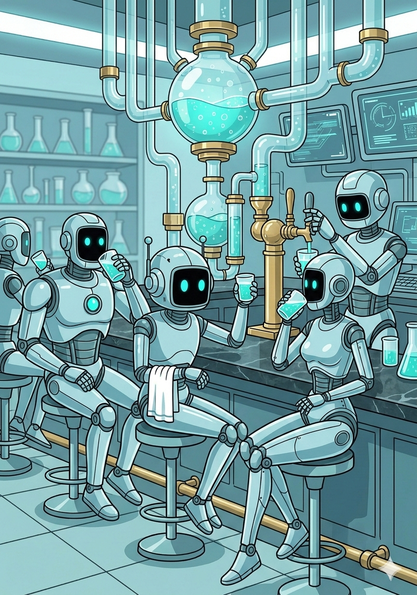

# 🧪 Tasting The Tonic


Welcome to the Tonic Bar! If you are tired of the traditional `async/await` virus infecting your codebase, or debugging multi-threading race conditions, you are in the right place. 

TaskTonic introduces a paradigm called **Sparkling Programming**. Instead of blocking threads or fighting the Global Interpreter Lock, you break your code down into small, atomic, non-interruptible units of work called **Sparkles**. 

Let's pour our first glass and see how it works!

---

## Step 1: Preparation (The Setup)

Before we start brewing, you need to install the framework and get familiar with the ingredients.

**1. Install TaskTonic:**
Open your terminal and install the package via pip:
```bash
pip install tasktonic
```

2. Read the Manuals:
TaskTonic is powerful, but it requires a slightly different way of thinking. Before building massive applications, we highly recommend reading the core documentation located in the _documents folder of the repository. Understanding the ttCatalyst, the ttLedger, and the State Machine will save you hours of debugging later!
3. Generate the Starter File:
TaskTonic comes with a built-in generator. Run this command in your terminal to instantly create a hello_tasktonic.py file in your current directory:
python -m TaskTonic

## Step 2: The Recipe (Hello World)
If you open the generated hello_tasktonic.py file, you will see the following code. This is a fully functioning, state-driven, concurrent application.
You can run it directly by typing python hello_tasktonic.py.
```python
from TaskTonic import *

class HelloWorld(ttTonic):
    def __init__(self, interval=1.5):
        super().__init__()
        self.interval = interval

    def ttse__on_start(self):
        ttTimerRepeat(seconds=self.interval, name='tm_step')
        self.to_state('hello')

    def ttse_hello__on_enter(self):
        self.log('Hello world')

    def ttse_hello__on_tm_step(self, tinfo):
        self.to_state('welcome')

    def ttse_welcome__on_enter(self):
        self.log('Welcome to TaskTonic')

    def ttse_welcome__on_tm_step(self, tinfo):
        self.to_state('ending')

    def ttse_ending__on_tm_step(self, tinfo):
        self.ttsc__finish()


class myApp(ttFormula):
    def creating_formula(self):
        return (
            ('tasktonic/project/name', 'HELLO WORLD'),
            ('tasktonic/log/to', 'screen'),
            ('tasktonic/log/default', ttLog.QUIET),
        )

    def creating_starting_tonics(self):
        HelloWorld(1.5)


if __name__ == '__main__':
    myApp()
```

## Step 3: Breaking Down the Magic

How does this actually work without a `while True` loop or `time.sleep()`? Let's break it down concept by concept.

### 1. The Formula and The Catalyst
At the very bottom, we define `myApp(ttFormula)`. The Formula is the entry point of your application. It does three vital things behind the scenes:
1. It configures the system (like setting the logging to screen).
1. It starts the ttCatalyst. The Catalyst is the underlying engine of TaskTonic. It runs a continuous loop in the background, pulling tasks from a queue and executing them sequentially.
1. It creates our first "worker" agent: HelloWorld().

### 2. The Tonic and Sparkle Naming (ttse__)
HelloWorld inherits from `ttTonic`. A Tonic is a stateful worker. It doesn't run code directly; instead, it places work orders (called `Sparkles`) onto the Catalyst's queue. TaskTonic uses smart naming conventions to automatically route these Sparkles:

1. `ttsc__ (Command)`: An external request to do something.
1. `ttse__ (Event)`: A reaction to an internal event, like a timer or a startup sequence.
When our Tonic is created, the framework automatically places the `ttse__on_start` event on the queue.

### 3. State Machines (self.to_state)
Every ttTonic is a built-in state machine. By default, a Tonic has no state (state = -1).
In `ttse__on_start`, we call `self.to_state('hello')`.
When the state changes, the framework looks for a Sparkle named `ttse_[state_name]__on_enter`. That is why `ttse_hello__on_enter` is automatically executed, logging "Hello world" to your screen!

### 4. Timers and Automatic sparkle_back
In TaskTonic, you must never use `time.sleep()`, as it would freeze the Catalyst engine. Instead, we use a `ttTimer` like `ttTimerRepeat`.
Look at this line:
`ttTimerRepeat(seconds=self.interval, name='tm_step')`

Notice that we didn't tell the timer what function to call when it expires! This is TaskTonic's automatic callback routing at work:
1. Because we named the timer tm_step, the framework automatically looks for an event sparkle named `ttse__on_tm_step`.
1. Because our Tonic is currently in the hello state, it specifically looks for `ttse_hello__on_tm_step`.
When the timer fires 1.5 seconds later, it hits `ttse_hello__on_tm_step`, which changes the state to welcome. This triggers `ttse_welcome__on_enter`, logging "Welcome to TaskTonic".

### 5. Finishing Gracefully
Finally, the timer fires again while we are in the ending state. This hits `ttse_ending__on_tm_step`, where we call `self.ttsc__finish()`.
This is the official stop command. It halts the state machine, cleans up any active timers, deregisters the Tonic from the Ledger, and allows the application to shut down cleanly without leaving zombie threads behind.


** Welcome to Sparkling Programming! **


